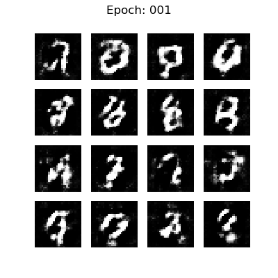
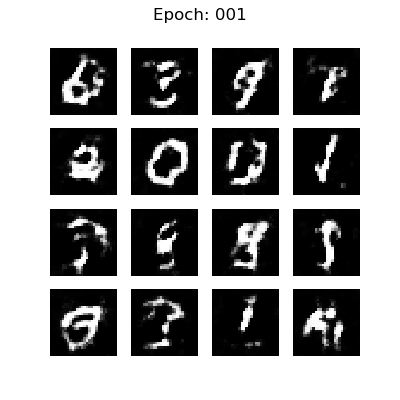
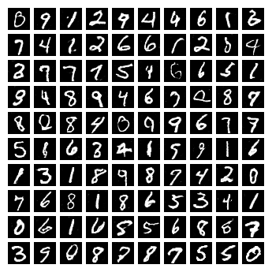
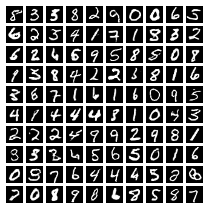
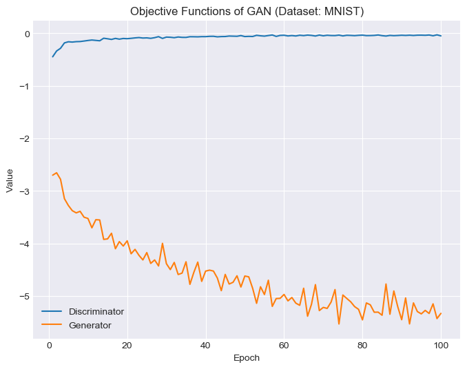
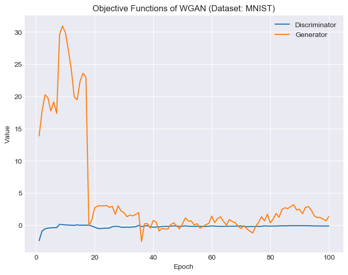
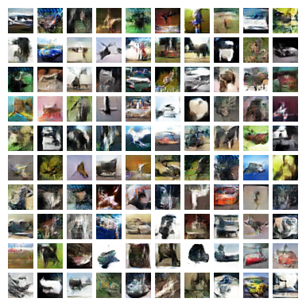
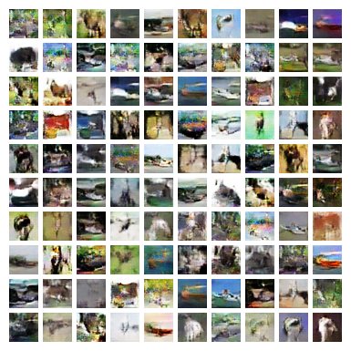

# WGAN-TF2

Yet another simple implementation of GAN and Wasserstein GAN using TensorFlow 2.

## Remarks
Following advice from the original GAN paper \[[Goo+14](http://papers.nips.cc/paper/5423-generative-adversarial-nets.pdf)\], we trained *G* by maximizing ln[*D*(*G*(***z***))] to avoid vanishing gradient.

We implemented the WGAN-LP variant \[[PFL17](https://arxiv.org/abs/1709.08894)\] in place of the ordinary WGAN \[[ACB17](https://arxiv.org/abs/1701.07875)\]. The gradient penalty is computed by perturbing the concatenation of real and fake data with Gaussian noises.

## Usage
- To train GAN on MNIST: 
  ```bash
  python main.py --model GAN --dataset MNIST
  ```
  
- To train WGAN on CIFAR-10: 
  ```bash
  python main.py --model WGAN --dataset CIFAR10
  ```

- To see available parameters and explaninations:
  ```bash
  python main.py --help
  ```

## Demo
For the MNIST dataset, we picked 16 seeds (respectively for both models) to showcase how the generators evolve. We also randomly generated 100 samples after 100 epochs of training. The (median) objective function values for GAN and WGAN are displayed at the end.
| GAN | WGAN |
|:-------------------------:|:-------------------------:|
|  |  |
|  |  |
|  |  |

Likewise, here we can see how the models evolve when training on the CIFAR-10 dataset. The generators turn out can be quite unstable for this data, fine tuning is therefore needed in order to get decent results.
| GAN | WGAN |
|:-------------------------:|:-------------------------:|
|  |  |
|  |  |

## Acknowledgment
The following tutorials/repos have provided immense help for this implementation:
- [Deep Convolutional Generative Adversarial Network](https://www.tensorflow.org/tutorials/generative/dcgan).

- Denis Lukovnikov's [WGAN-GP reproduction](https://github.com/lukovnikov/improved_wgan_training).

- Junghoon Seo's [WGAN-LP reproduction](https://github.com/mikigom/WGAN-LP-tensorflow).


## References
- Martin Arjovsky, Soumith Chintala, and Léon Bottou. *Wasserstein GAN*. 2017. arXiv: [1701.07875 \[stat.ML\]](https://arxiv.org/abs/1701.07875).

- Ian Goodfellow et al. *Generative Adversarial Nets*. 2014. In: *Advances in Neural Information Processing Systems 27*.

- Ishaan Gulrajani et al. *Improved Training of Wasserstein GANs*. 2017. arXiv: [1704.00028 [cs.LG]](https://arxiv.org/abs/1704.00028).

- Naveen Kodali et al. *On Convergence and Stability of GANs*. 2017. arXiv: [1705.07215 [cs.AI]](https://arxiv.org/abs/1705.07215).

- Henning Petzka, Asja Fischer, and Denis Lukovnicov. *On the regularization of Wasserstein GANs*. 2017. arXiv: [1709.08894 [stat.ML]](https://arxiv.org/abs/1709.08894).

- Tim Salimans et al. *Improved Techniques for Training GANs*. 2016. arXiv: [1606.03498 [cs.LG]](https://arxiv.org/abs/1606.03498).
